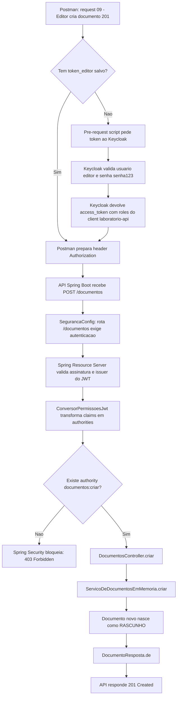
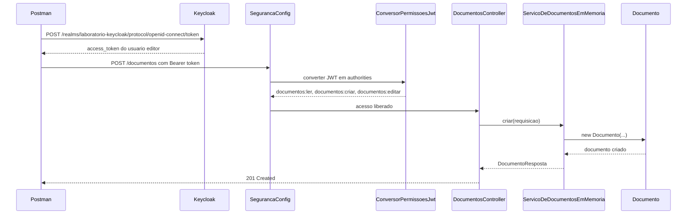

# Fluxo Completo: `POST /documentos`

Este fluxo mostra o caminho de uma chamada que cria um documento. Ele comeca no Postman, passa pelo login no Keycloak, entra no Spring Security, verifica permissao e chega no codigo do dominio.

Endpoint escolhido:

```http
POST http://localhost:8081/documentos
Authorization: Bearer <token do editor>
Content-Type: application/json

{
  "titulo": "Documento criado pelo editor",
  "conteudo": "Este endpoint exige documentos:criar."
}
```

Usuario usado:

```text
editor
```

Permissao necessaria:

```text
documentos:criar
```

## Fluxograma Geral



## Sequencia Com Participantes



## Cena 1: Postman Decide Quem Vai Logar

Arquivo:

```text
postman/laboratorio-keycloak-estilo-keycloak-projeto.postman_collection.json
```

No request `09 - Editor cria documento 201`, existe este header:

```text
X-Usuario-Teste: editor
```

Esse header nao e enviado para a API. Ele serve como bilhete interno para o pre-request script:

```javascript
var username = pm.request.headers.get("X-Usuario-Teste")
    || pm.environment.get("usuario_teste")
    || "leitor";
```

Traduzindo:

- se o request disser `X-Usuario-Teste: editor`, usa `editor`;
- se nao disser, tenta usar a variavel `usuario_teste`;
- se nada existir, usa `leitor`.

Depois o script remove esse header:

```javascript
pm.request.headers.remove("X-Usuario-Teste");
```

Isso evita que a API receba um header que so existe para ajudar no laboratorio.

## Cena 2: Postman Faz Login No Keycloak

O pre-request script chama:

```http
POST http://localhost:8080/realms/laboratorio-keycloak/protocol/openid-connect/token
```

Com dados equivalentes a:

```text
grant_type=password
client_id=laboratorio-api
client_secret=laboratorio-api-secret
username=editor
password=senha123
```

Quem participa aqui:

- **Keycloak**: confere se o usuario existe, se a senha bate e se o client pode emitir token.
- **Realm `laboratorio-keycloak`**: ambiente onde usuarios, client, roles, recursos, escopos, politicas e permissoes foram cadastrados.
- **Client `laboratorio-api`**: representa nossa API dentro do Keycloak.
- **Usuario `editor`**: possui `documentos:ler`, `documentos:criar` e `documentos:editar`.

Se tudo estiver certo, o Keycloak devolve um `access_token`.

## Cena 3: Postman Guarda o Token

O script salva o token:

```javascript
pm.environment.set(`token_${username}`, token);
pm.environment.set("token", token);
```

Para o usuario `editor`, isso vira:

```text
token_editor=<access_token>
token=<access_token>
```

Depois ele injeta o header real:

```javascript
pm.request.headers.upsert({
  key: "Authorization",
  value: `Bearer ${token}`
});
```

Agora a chamada para a API sai assim:

```http
POST http://localhost:8081/documentos
Authorization: Bearer eyJ...
Content-Type: application/json
```

## Cena 4: A API Recebe a Chamada

Arquivo:

```text
backend/src/main/resources/application.yml
```

Aqui a API sabe em qual porta subir e em qual issuer confiar:

```yaml
server:
  port: 8081

spring:
  security:
    oauth2:
      resourceserver:
        jwt:
          issuer-uri: ${KEYCLOAK_ISSUER_URI:http://localhost:8080/realms/laboratorio-keycloak}
```

O ponto mais importante:

```text
issuer-uri = http://localhost:8080/realms/laboratorio-keycloak
```

Isso diz para o Spring:

> "Eu so confio em tokens emitidos por esse realm do Keycloak."

## Cena 5: `SegurancaConfig` Entra em Cena

Arquivo:

```text
backend/src/main/java/br/com/wanderlei/keycloakestudo/configuracao/SegurancaConfig.java
```

Classe:

```java
SegurancaConfig
```

Responsabilidade:

> Define quais endpoints sao livres, quais exigem login e como o JWT sera convertido em permissoes do Spring.

Trecho importante:

```java
.authorizeHttpRequests(registry -> registry
        .requestMatchers("/publico/**").permitAll()
        .requestMatchers("/usuario/**").authenticated()
        .requestMatchers("/documentos/**").authenticated()
        .anyRequest().authenticated()
)
```

Para `POST /documentos`, cai aqui:

```java
.requestMatchers("/documentos/**").authenticated()
```

Ou seja:

> Primeiro filtro: precisa estar autenticado.

Depois vem:

```java
.oauth2ResourceServer(oauth2 -> oauth2
        .jwt(jwt -> jwt.jwtAuthenticationConverter(new ConversorPermissoesJwt(clientId)))
)
```

Traduzindo:

> "Spring, quando chegar um JWT, use `ConversorPermissoesJwt` para descobrir as permissoes desse usuario."

## Cena 6: Spring Valida o Token

Antes de chamar nosso controller, o Spring Resource Server valida o token:

- o token existe?
- esta no formato JWT?
- foi emitido pelo issuer correto?
- assinatura bate com as chaves publicas do Keycloak?
- ainda nao expirou?

Se falhar aqui:

```text
401 Unauthorized
```

Exemplo:

```text
sem token -> 401
token invalido -> 401
token expirado -> 401
```

## Cena 7: `ConversorPermissoesJwt` Transforma Token Em Permissoes

Arquivo:

```text
backend/src/main/java/br/com/wanderlei/keycloakestudo/configuracao/ConversorPermissoesJwt.java
```

Classe:

```java
ConversorPermissoesJwt
```

Responsabilidade:

> Ler o JWT do Keycloak e transformar roles/scopes em `GrantedAuthority`, que e o formato que o Spring Security entende.

Metodo principal:

```java
public AbstractAuthenticationToken convert(Jwt jwt)
```

Ele chama quatro leituras:

```java
adicionarScopes(jwt, authorities);
adicionarRolesDoRealm(jwt, authorities);
adicionarRolesDoClient(jwt, authorities);
adicionarPermissoesDeAutorizacao(jwt, authorities);
```

Para nosso caso, a parte mais didatica e esta:

```java
adicionarRolesDoClient(jwt, authorities);
```

Ela procura no token:

```json
{
  "resource_access": {
    "laboratorio-api": {
      "roles": [
        "documentos:ler",
        "documentos:criar",
        "documentos:editar"
      ]
    }
  }
}
```

E transforma em authorities do Spring:

```text
documentos:ler
SCOPE_documentos:ler
documentos:criar
SCOPE_documentos:criar
documentos:editar
SCOPE_documentos:editar
```

Por que ele cria duas versoes?

- `documentos:criar`: fica facil usar com `hasAuthority('documentos:criar')`;
- `SCOPE_documentos:criar`: fica compativel com o padrao comum de scopes do Spring.

## Cena 8: `DocumentosController` Exige a Permissao Certa

Arquivo:

```text
backend/src/main/java/br/com/wanderlei/keycloakestudo/documentos/DocumentosController.java
```

Classe:

```java
DocumentosController
```

Metodo:

```java
criar(CriarDocumentoRequisicao requisicao)
```

Trecho:

```java
@PostMapping
@PreAuthorize("hasAuthority('documentos:criar')")
public ResponseEntity<DocumentoResposta> criar(@Valid @RequestBody CriarDocumentoRequisicao requisicao) {
    DocumentoResposta resposta = servico.criar(requisicao);
    return ResponseEntity.created(URI.create("/documentos/" + resposta.id())).body(resposta);
}
```

Aqui acontece a diferenca entre `401` e `403`.

Se nao tem token:

```text
401 Unauthorized
```

Se tem token, mas nao tem `documentos:criar`:

```text
403 Forbidden
```

Exemplo:

```text
leitor tentando POST /documentos -> 403
```

Se tem token e tem `documentos:criar`:

```text
editor tentando POST /documentos -> liberado
```

## Cena 9: `CriarDocumentoRequisicao` Valida o Corpo

Arquivo:

```text
backend/src/main/java/br/com/wanderlei/keycloakestudo/documentos/CriarDocumentoRequisicao.java
```

Classe:

```java
CriarDocumentoRequisicao
```

Responsabilidade:

> Representar o JSON recebido no body da requisicao.

Codigo:

```java
public record CriarDocumentoRequisicao(
        @NotBlank String titulo,
        @NotBlank String conteudo
) {
}
```

O `@Valid` no controller ativa essas regras.

Se vier assim:

```json
{
  "titulo": "",
  "conteudo": ""
}
```

O endpoint nao deve aceitar, porque `titulo` e `conteudo` nao podem ser vazios.

## Cena 10: `ServicoDeDocumentosEmMemoria` Executa a Regra

Arquivo:

```text
backend/src/main/java/br/com/wanderlei/keycloakestudo/documentos/ServicoDeDocumentosEmMemoria.java
```

Classe:

```java
ServicoDeDocumentosEmMemoria
```

Responsabilidade:

> Guardar documentos em memoria e executar as operacoes do dominio.

Metodo:

```java
public DocumentoResposta criar(CriarDocumentoRequisicao requisicao)
```

Codigo:

```java
String id = "doc-" + UUID.randomUUID();
Documento documento = new Documento(id, requisicao.titulo(), requisicao.conteudo(),
        StatusDocumento.RASCUNHO, "usuario-logado");
documentos.put(id, documento);
return DocumentoResposta.de(documento);
```

Aqui ele:

1. cria um id novo;
2. cria um `Documento`;
3. coloca status inicial `RASCUNHO`;
4. salva no `Map<String, Documento>`;
5. devolve uma resposta pronta para JSON.

## Cena 11: `Documento` Nasce

Arquivo:

```text
backend/src/main/java/br/com/wanderlei/keycloakestudo/documentos/Documento.java
```

Classe:

```java
Documento
```

Responsabilidade:

> Representar o objeto de negocio.

No `POST /documentos`, ele nasce assim:

```java
new Documento(id, titulo, conteudo, StatusDocumento.RASCUNHO, "usuario-logado")
```

Estado inicial:

```text
id = doc-...
titulo = recebido no JSON
conteudo = recebido no JSON
status = RASCUNHO
criadoPor = usuario-logado
```

## Cena 12: `DocumentoResposta` Vira JSON

Arquivo:

```text
backend/src/main/java/br/com/wanderlei/keycloakestudo/documentos/DocumentoResposta.java
```

Classe:

```java
DocumentoResposta
```

Responsabilidade:

> Definir o formato da resposta que sai da API.

Codigo:

```java
public record DocumentoResposta(
        String id,
        String titulo,
        String conteudo,
        String status
)
```

Resposta esperada:

```http
201 Created
Location: /documentos/doc-...
```

Body:

```json
{
  "id": "doc-...",
  "titulo": "Documento criado pelo editor",
  "conteudo": "Este endpoint exige documentos:criar.",
  "status": "RASCUNHO"
}
```

## Quem Entra Em Cena, Em Ordem

| Ordem | Participante | Tipo | O que faz |
|---:|---|---|---|
| 1 | Postman | Cliente HTTP | Decide usar `editor` e monta a chamada |
| 2 | Pre-request script | Script Postman | Busca token no Keycloak e injeta `Authorization` |
| 3 | Keycloak | Servidor de identidade | Autentica `editor` e emite JWT |
| 4 | `application.yml` | Configuracao | Diz a porta da API e o issuer confiavel |
| 5 | `SegurancaConfig` | Configuracao Spring | Exige login para `/documentos/**` |
| 6 | Spring Resource Server | Framework | Valida assinatura, issuer e expiracao do JWT |
| 7 | `ConversorPermissoesJwt` | Classe de seguranca | Transforma roles do Keycloak em authorities |
| 8 | `DocumentosController` | Controller REST | Exige `documentos:criar` e recebe o body |
| 9 | `CriarDocumentoRequisicao` | DTO de entrada | Representa e valida `titulo` e `conteudo` |
| 10 | `ServicoDeDocumentosEmMemoria` | Servico de dominio | Cria e guarda o documento em memoria |
| 11 | `Documento` | Entidade de dominio | Guarda estado e comportamento do documento |
| 12 | `DocumentoResposta` | DTO de saida | Define o JSON de resposta |

## Como Ler Isso Mentalmente

Pensa em tres portoes:

```text
Portao 1: Voce e quem diz ser?
Resposta ruim aqui: 401
Classe principal: SegurancaConfig + Spring Resource Server
```

```text
Portao 2: Voce tem a permissao especifica?
Resposta ruim aqui: 403
Classe principal: ConversorPermissoesJwt + @PreAuthorize
```

```text
Portao 3: A regra de negocio aceita criar?
Resposta ruim aqui: 400, 404 ou alguma regra futura
Classe principal: DocumentosController + ServicoDeDocumentosEmMemoria
```

Neste endpoint, o caminho feliz e:

```text
editor -> token valido -> documentos:criar -> DocumentosController.criar -> ServicoDeDocumentosEmMemoria.criar -> 201 Created
```

E o caminho negado mais didatico e:

```text
leitor -> token valido -> nao tem documentos:criar -> 403 Forbidden
```
